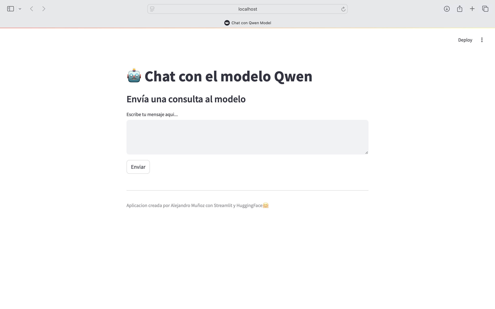

# Chat con el Modelo Qwen

Este proyecto utiliza **Streamlit** y **Hugging Face API** para crear una aplicación web interactiva en la que los usuarios pueden enviar mensajes y recibir respuestas generadas por el modelo **Qwen/QwQ-32B-Preview**.

## Descripción

La aplicación permite que los usuarios interactúen con el modelo de lenguaje Qwen para obtener respuestas a sus preguntas o consultas. La aplicación está construida utilizando Streamlit para la interfaz de usuario y utiliza la API de Hugging Face para generar respuestas.

### Características:
- Interfaz simple y limpia basada en **Streamlit**.
- Comunicación con el modelo a través de la **API de Hugging Face**.

## Requisitos

Antes de ejecutar este proyecto, asegúrate de tener las siguientes dependencias instaladas:

- **Python 3.7 o superior**
- **Streamlit**
- **Requests**

Puedes instalar las dependencias necesarias ejecutando los siguientes comandos:

### Instalar las dependencias:

1. Crea un entorno virtual (opcional, pero recomendado):

```bash
python3 -m venv venv
source venv/bin/activate 
venv\Scripts\activate 
```

2. Instala **Streamlit** y **Requests**:

```bash
python3 -m pip install streamlit requests
```

## Configuración de la API

El proyecto utiliza la **API de Hugging Face** para interactuar con el modelo **Qwen/QwQ-32B-Preview**. Asegúrate de tener una **clave de API** válida de Hugging Face. Si no tienes una, puedes obtenerla en [Hugging Face](https://huggingface.co/settings/tokens).

### Cambia tu clave de API

En el archivo `qwen.py`, cambia el valor de la variable `API_KEY` por tu clave personal de la siguiente manera:

```python
API_KEY = "tu_clave_api_aqui"
```

## Ejecución del Proyecto

Para ejecutar la aplicación, sigue estos pasos:

1. Asegúrate de estar en el directorio donde se encuentra el archivo `qwen.py`.
2. Ejecuta el siguiente comando para iniciar la aplicación:

```bash
streamlit run qwen.py
```

Esto abrirá la aplicación en tu navegador web predeterminado, donde podrás interactuar con el modelo Qwen.


### Interfaz de Usuario

Aquí tienes una captura de pantalla de la interfaz de usuario de la aplicación:



## URLs

- **Local URL**: [http://localhost:8501](http://localhost:8501)
- **Network URL**: [http://<tu_dirección_IP>:8501](http://<tu_dirección_IP>:8501)


